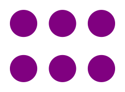

# Customblocks for Markdown

[](https://github.com/vokimon/markdown-customblocks/actions/workflows/main.yml)
[](https://coveralls.io/r/vokimon/markdown-customblocks)
[](https://pypi.org/project/markdown-customblocks/)
[](https://www.gnu.org/licenses/agpl-3.0)
[](https://pypi.org/project/markdown-customblocks/)
<!--
[](https://pypi.org/project/markdown-customblocks/)
[](https://pypi.org/project/markdown-customblocks/)
-->

Customblocks is an extension for [Python-Markdown]
that settles a **common markup** for **parametrizable and nestable components**
whose output can be **redefined** by means of a simple Python function.

Many off-the-shelf components are provided such as
div-containers, admonitions, figures, link cards, maps...
and some embeded widgets from common sites (wikipedia, youtube, vimeo, peertube, mastodon, twitter, facebook, instagram, goteo, verkami...)

It also includes convenience tools to ease component definition:
hyperscript html generation, cached page fetching and metadata page extraction.

[Python-Markdown]: https://python-markdown.github.io/


## Installation and setup

To install:

```bash
$ pip install markdown-customblocks
```

And then activate it as any other Markdown extension.

From command line:

```bash
$ markdown -x customblocks ...
```

In Python code:

```python
import markdown
md = markdown.Markdown(extensions=["customblocks"])
md.convert(markdowncontent)
```

In [Pelican](https://blog.getpelican.com/) config:

```python
MARKDOWN = {
    'extensions': [
        'customblocks',
    ],
}
```

For [MkDocs](https://www.mkdocs.org), add this to `mkdocs.yml`:

```yaml
markdown_extensions:
  - customblocks
```

If you need to specify additional parameters for the extension,
refer to the documentation of your generator.


## Basic usage

Customblocks extension parses markup structures like this one:

```markdown
::: mytype "value 1" param2=value2
    Indented content
```
Then, the extension delegates HTML generation to a Python function (_generator_)
which is bound to the type name, `mytype` in the example.

The extension provides many predefined generators
and you might define your own for new types or
redefine existing ones to suit your needs.

If no generator is bound to the type name,
the div-container generator is used as fallback,
generating this:

```html
<div class="mytype value-1" param2="value2">
   <p>Indented code</p>
</div>
```


But we could bind `mytype` to the following generator:

```python
def mygenerator(ctx, param1, param2):
    return f"""<div attrib1="{param1}" attrib2="{param2}">{ctx.content}</div>"""
```

That would generate this HTML:

```html
<div attrib1="value 1" attrib2="value2">Indented Content</div>
```

The previous example, may work for simple cases,
but it won't work in a general scenario.
Parameters and content are included as is and
they should be escaped or processed as Markdown content.
Luckily, `customblocks` provides some useful tools for that:
the hyperscript generator and the Markdown subparser:

```python
from customblocks.utils import E, Markdown

def mygenerator(ctx, param1, param2):
    return E('', attrib1=param1, attrib2=param2,
        Markdown(ctx.content, ctx.parser)
    )
```

You can read more about them at the [related documentation](https://vokimon.github.io/markdown-customblocks/defining-generators/#hyperscript).

## Built-in generators

The extension provides the following predefined generators:

- [`container`](https://vokimon.github.io/markdown-customblocks/generators-container/):
    A div element with arbitrary classes, attributes and content. This is the default when no type matches.
- [`admonition`](https://vokimon.github.io/markdown-customblocks/generators-admonition/):
    Admonitions, boxes for notes, warnings... (quite similar to the [standard extra extension][ExtraAdmonitions]).
    It is bound to types `note`,  `info`, `error`, `warning`....
- [`figure`](https://vokimon.github.io/markdown-customblocks/generators-figure/):
    Full featured figures with captions, lightbox...
- [`map`](https://vokimon.github.io/markdown-customblocks/generators-map/):
    Maps from OpenStreetMaps.or
- [`linkcard`](https://vokimon.github.io/markdown-customblocks/generators-linkcard/):
    External link cards (like Facebook and Twitter do, when you post a link)
- [`wikipedia`](https://vokimon.github.io/markdown-customblocks/generators-wikipedia/):
    Wikipedia article card by lemma (and language)
- [`youtube`](https://vokimon.github.io/markdown-customblocks/generators-youtube/):
    Embeded videos from youtube...
- [`vimeo`](https://vokimon.github.io/markdown-customblocks/generators-vimeo/):
    Embeded videos from vimeo...
- [`twitter`](https://vokimon.github.io/markdown-customblocks/generators-twitter/):
    Embeded tweets
- [`facebook`](https://vokimon.github.io/markdown-customblocks/generators-facebook/):
    Embeded post from facebook...
- [`instagram`](https://vokimon.github.io/markdown-customblocks/generators-instagram/):
    Embeded post from instagram...
- [`verkami`](https://vokimon.github.io/markdown-customblocks/generators-verkami/):
    Fund raising project widget in [Verkami]
- [`goteo`](https://vokimon.github.io/markdown-customblocks/generators-goteo/):
    Fund raising project widget in [Goteo]

[ExtraAdmonitions]: https://python-markdown.github.io/extensions/admonition/


## General markup syntax

This is a more complete example of markup:

```markdown
::: mytype param1 key1=value1 "other param" key2='value2 with words' flag1 noflag2
    Indented **content**

    The block ends whenever the indentation stops
This unindented line is not considered part of the block
```

**The headline:**
The line starting with `:::` is the _headline_.
It specifies, first, the block type (`mytype`) followed by a set of _values_
that will be passed to the generator as parameters.


**Block type:**
The type is used to select the generator function.
If there is no generator bound to the type, the div-container generator, will be used by default.

**Quotes:**
Muti-word values can be passed by using either single or double quotes.
You can skip quotes if your value is single worded.

**Explicit keywords:**
Also some values may target an explicit parameter with a _key_.
This works as follows:
from the available block parameters, values with a key are set first,
then the remaining unset parameters are filled by position.

**Flags (bools):**
Boolean parameters (flags) can be set by just adding a value with the name of the flag, like `flag1` in the example.
And they can be unset by adding the name with a `no` prefix, like `noflag2` in the example.

**Content:**
After the _headline_, several lines of indented _content_ may follow.
The content ends with the very first non-emtpy line back on the previous indentation.

Indentation is removed from the content for the generator to process it.
A block type may choose to interpret this content as markdown as well.
So you can have nested blocks by adding extra indentation.
For example:

```markdown
::: recipe
    # Sweet water
    ::: ingredients "4 persons"
        - two spons of suggar
        - a glass of tap water
    ::: mealphoto sweetwater.jpg
        Looks gorgeus!
    Drop the suggar into the glass. Stir.
```

::: note
    A closing `:::` tag is optional.
    For most cases, indentation should be enough, visually, and functionally.
    But, seldomly, it is necessary.
    Like in the example below, where
    the mealphoto content would be mixed with 
    the later code block

        ::: mealphoto sweetwater.jpg
                Looks gorgeus!
        :::
                This is a code block by indentation


## Further reading

- [Full documentation](https://vokimon.github.io/markdown-customblocks)
- [Code](https://github.com/vokimon/markdown-customblocks)
- [Release History](https://vokimon.github.io/markdown-customblocks/CHANGES)
- [Road map](https://vokimon.github.io/markdown-customblocks/TODO)
- [Motivation and design choices](https://vokimon.github.io/markdown-customblocks/motivation)
- [Inspiration and kudos](https://vokimon.github.io/markdown-customblocks/inspiration)


